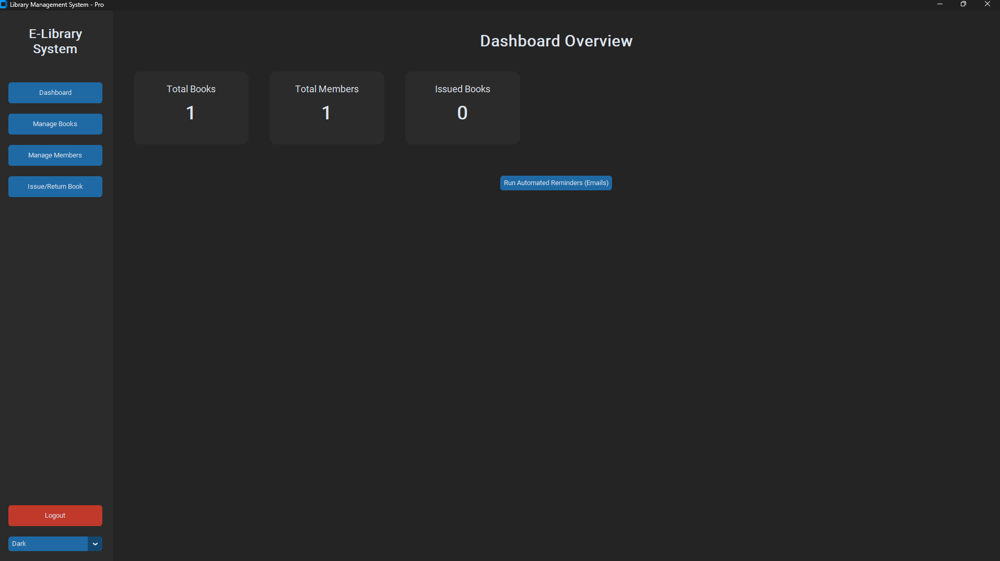
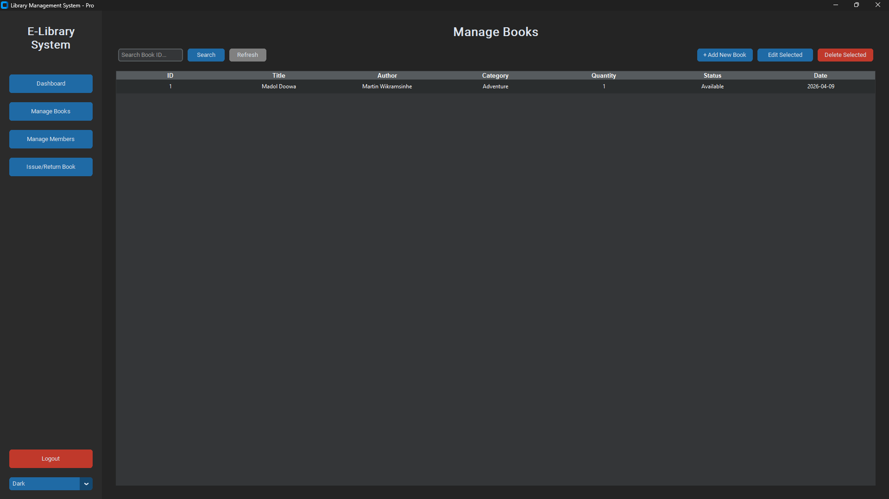
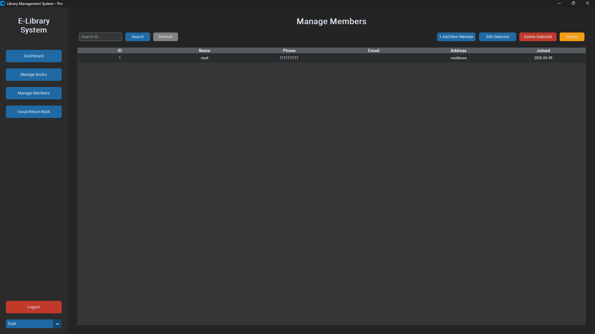

# Advanced Library Management System (Python)

A modern, full-featured Library Management System built with Python, CustomTkinter (for a sleek UI), and MySQL (XAMPP). This project allows library administrators to smoothly manage books, members, borrowing records, automated email notifications, and late return fines.

## 📸 Screenshots

| Dashboard | Manage Books | Manage Members |
|:---:|:---:|:---:|
|  |  |  |

## 🚀 Features

- **Dynamic Theme Switcher**: Toggle between Dark Mode and Light Mode instantly.
- **Manage Books & Copies**: Add, edit, delete, and search books. Automatically tracks quantity (copies) of books during issue and returns.
- **Manage Members**: Register new library members, update contact details, and view the entire borrowing **History** of a specific member.
- **Issue & Return Lifecycle**: Efficiently issue books for a standard period (14 days) and return them seamlessly.
- **Fine Calculation System**: Automatically calculates over-due periods and applies fixed fine rules (e.g., Rs. 50/day).
- **Email Notifications & Reminders (SMTP)**: 
  - Automated issue confirmation emails dispatched directly to the member's email.
  - Generates 1-day & 7-day automated warning emails to members nearing their due dates.

## 📦 Prerequisites

1. **Python 3.8+** installed on your machine.
2. **XAMPP** (or any MySQL server environment).

## 🛠️ Installation & Setup

1. **Clone the repository:**
   ```bash
   git clone <your-github-repo-url>
   ```

2. **Install dependencies:**
   ```bash
   pip install -r requirements.txt
   ```

3. **Database Configuration:**
   - Open **XAMPP Control Panel** and start the **MySQL** module.
   - Run the database setup script to auto-generate the database `library_system` and its tables:
   ```bash
   python db_setup.py
   python db_update.py
   ```

4. **Email Configuration (Required for sending real emails):**
   - Open `main.py` in a code editor.
   - Locate lines 13 & 14:
     ```python
     YOUR_EMAIL = "your_email@gmail.com"
     YOUR_APP_PASSWORD = "your_app_password"
     ```
   - Replace these with your actual Gmail account and generated [Google App Password](https://support.google.com/accounts/answer/185833).

## 🎮 How to Run

Execute the main application GUI:
```bash
python main.py
```

### Default Admin Login
- **Username:** `admin`
- **Password:** `admin123`

## 👨‍💻 Built With
* [Python](https://www.python.org/)
* [CustomTkinter](https://github.com/TomSchimansky/CustomTkinter)
* [MySQL Connector](https://pypi.org/project/mysql-connector-python/)
